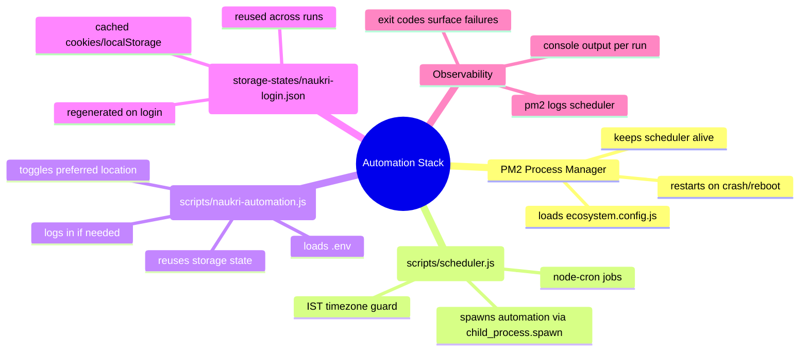

# Naukri Automation Stack Guide

## Index
1. [Quick Reference Mindmap](#quick-reference-mindmap)
2. [Component Responsibilities](#component-responsibilities)
3. [End-to-End Execution Flow](#end-to-end-execution-flow)
4. [Storage State Lifecycle](#storage-state-lifecycle)
5. [PM2 Operations Cheat Sheet](#pm2-operations-cheat-sheet)
6. [Scheduler Job Matrix](#scheduler-job-matrix)
7. [Environment & Configuration](#environment--configuration)
8. [First-Time Setup Checklist](#first-time-setup-checklist)

---

## Quick Reference Mindmap



---

## Component Responsibilities

- **ecosystem.config.js (`root`)**
	- Defines a single PM2 app named `scheduler`.
	- Ensures `scripts/scheduler.js` is the only long-running process you need to manage.
	- PM2 auto-restarts the scheduler `max_restarts: 10` with `restart_delay: 5s`.

- **Scheduler (`scripts/scheduler.js`)**
	- Imports `node-cron` and registers two cron expressions (`08:30` & `11:30` IST, Monday–Friday).
	- Uses `child_process.spawn` to invoke `node scripts/naukri-automation.js` in the project root so every run is isolated.
	- Mirrors the parent environment (`env: process.env`) so `.env` is honored.
	- Streams stdout/stderr directly to PM2 logs for traceability.

- **Automation script (`scripts/naukri-automation.js`)**
	1. Loads `.env` via `dotenv`.
	2. Attempts to reuse `storage-states/naukri-login.json` (via `scripts/utils/storage-state.js`).
	3. If the storage state is invalid, executes a deterministic login flow and saves a fresh state.
	4. Navigates to the profile page and toggles the preferred location chip defined by `NAUKRI_TOGGLE_CITY`.
	5. Closes the browser cleanly to free resources for the next scheduled run.

- **Storage utility (`scripts/utils/storage-state.js`)**
	- Knows the storage directory (`storage-states/`) and file name (`naukri-login.json`).
	- Provides helper functions to ensure the directory exists, load the saved state path, or persist a new state from a Playwright context.

---

## End-to-End Execution Flow

```
┌──────────────────────────────────────────────────────────────────────────────┐
│ Server Boot / Deployment                                                     │
└──────────────────────────────────────────────────────────────────────────────┘
            │
            ▼
      pm2 start ecosystem.config.js
            │
            ▼
┌──────────────────────────────┐
│ PM2 keeps scheduler online   │
└──────────────────────────────┘
            │
            ▼ (08:30 & 11:30 IST, Mon–Fri)
┌──────────────────────────────┐
│ node-cron triggers job       │
└──────────────────────────────┘
            │ spawn child
            ▼
┌──────────────────────────────┐
│ node scripts/naukri-automation.js          │
└──────────────────────────────┘
            │
            ▼
   ┌──────────────────────────────────────────────────────────┐
   │ Playwright Context Lifecycle                             │
   │ 1. Load storage state if present                         │
   │ 2. If stale, perform login + save new state              │
   │ 3. Navigate to Career Preferences                       │
   │ 4. Toggle `NAUKRI_TOGGLE_CITY` chip                      │
   │ 5. Save & exit                                           │
   └──────────────────────────────────────────────────────────┘
            │
            ▼
      Exit code bubbles up → PM2 logs capture outcome
```

---

## Storage State Lifecycle

- **Location**: `storage-states/naukri-login.json` (ignored by Git; unique per machine).
- **Creation trigger**: First successful login (`scripts/naukri-automation.js` calls `saveStorageState(context)`).
- **Reuse path**: On subsequent runs `loadStorageStatePath()` checks if the file exists and injects it into the Playwright context, skipping the login UI.
- **Invalidation handling**:
	- If Naukri expires the session, the script detects login redirect (`LOGIN_URL_MATCHER`) and re-enters the full login flow.
	- The file is transparently overwritten with the new session data.
- **Manual reset**:
	- Delete the file (`rm storage-states/naukri-login.json`) to force a clean login on the next run.
	- Useful when migrating credentials or when Naukri forces MFA/password resets.

---

## PM2 Operations Cheat Sheet

| Action | Command | Notes |
| --- | --- | --- |
| Start daemon | `npm run pm2:start` | Runs `pm2 start ecosystem.config.js --env production`. |
| Persist across reboots | `pm2 save && pm2 startup systemd` | `startup` outputs a command to run as sudo once. |
| Check process list | `pm2 list` | Confirms the `scheduler` app is online. |
| Tail logs | `pm2 logs scheduler` | Streams stdout/stderr from both the scheduler and child runs. |
| Restart | `pm2 restart scheduler` | Picks up `.env` changes without reboot. |
| Stop/Delete | `pm2 stop scheduler` / `pm2 delete scheduler` | Use `delete` when uninstalling. |

---

## Scheduler Job Matrix

| Job | Cron Expression | Local Timezone Interpretation | Action |
| --- | --- | --- | --- |
| Morning Refresh | `0 30 8 * * 1-5` | Fires 08:30 Monday–Friday in `Asia/Kolkata` regardless of server timezone. | Runs `naukri-automation.js` once. |
| Late Morning Refresh | `0 30 11 * * 1-5` | Fires 11:30 Monday–Friday in `Asia/Kolkata`. | Runs `naukri-automation.js` once. |

> Both jobs reuse the same runner to keep the footprint small; node-cron and PM2 handle concurrency (if one run overlaps another, the second run will start after the first finishes because each job spawns a separate Node process).

---

## Environment & Configuration

- `.env` (based on `example.env`) must define:
	- `USER_EMAIL` and `USER_PASSWORD` (required for login fallback).
	- `NAUKRI_TOGGLE_CITY` (defaults to `Kolkata`).
	- `HEADLESS=true` if running without UI (recommended on servers or when using `xvfb-run`).
- Optional helpers:
	- Use `xvfb-run -a` when no display is available (Ubuntu servers).
	- Keep `.env` close to the repo root so `dotenv` picks it up automatically.

---

## First-Time Setup Checklist

1. **Install prerequisites**: Node.js 18+, npm, Playwright dependencies, and PM2 (`npm install -g pm2`).
2. **Clone & configure**:
	- `git clone ... && cd naukriByMe`
	- `cp example.env .env` and fill credentials.
	- `npm install`.
3. **One-off validation**: `npm run automate` (or `xvfb-run -a npm run automate`) to ensure login succeeds and storage state is created.
4. **Daemonize**:
	- `npm run pm2:start`
	- `pm2 save && pm2 startup systemd`
5. **Monitor**:
	- `pm2 list` for health.
	- `pm2 logs scheduler` after each scheduled window to confirm the run toggled the preferred location.

This guide doubles as a runbook and onboarding document—new contributors can follow the index to understand how PM2, the scheduler, and the Playwright automation collaborate.

